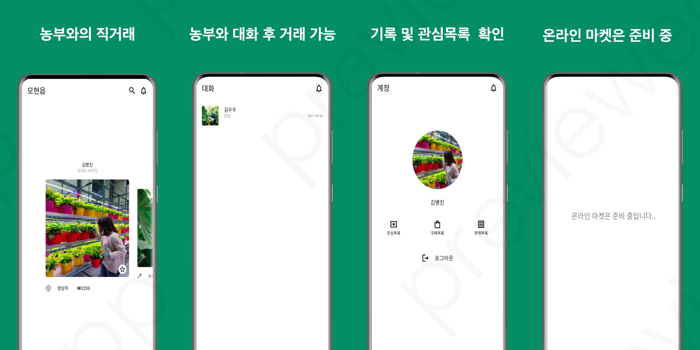
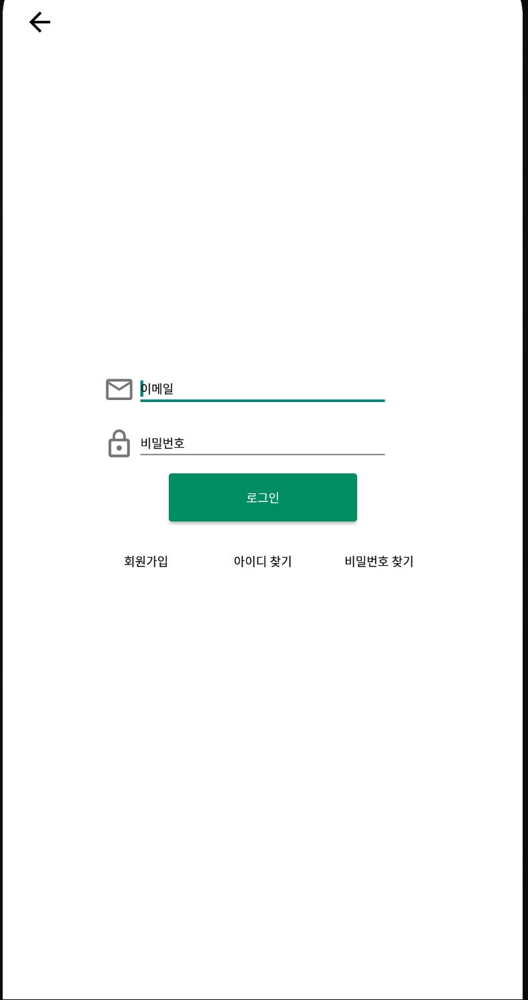
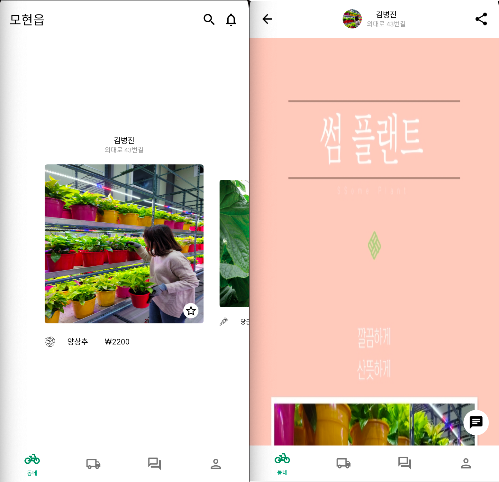
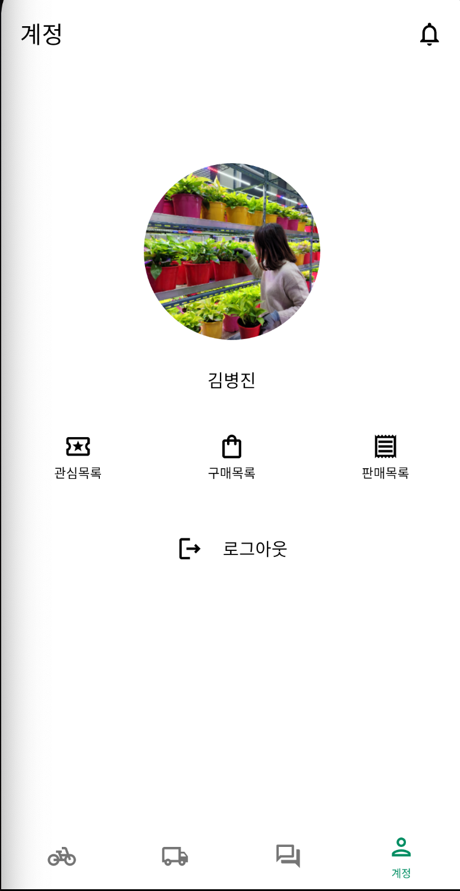

# PlantPoint Android (On Beta Service)

This application want to resolve the problem that farmer sell cheap and consumer buy expensive. In other words, This app made to decrease marketing cost. It offers chatting with farmers and consumer and then they buy and sell in person. Also, plan to make a online shopping service.

  

 

## Prerequisite

STEP 1. Make a Firebase Project.

STEP 2. Get the **google-services.json**.

STEP 3. Locate this file to app directory.

 

## Environments

* OS : Mac
* Language : Kotlin
* DB & Backend : Firebase

 

## Usage

* AUTH

  

Sign In and Log In Fragment. Chat service needs to be logged in.

*  OFFLINE TRADE

  

It shows the farmers close to your location. if you click the farmer image, you can see the products detail farmer selling. If you push the star button, you can see the star collection in "my page".

 

* CHAT

  

You can chat with farmers and make a deal or ask where we gonna meet. This data will be stored in Firestore.

 

* ACCOUNT

  

Account shows list of farmers that you put a start, what you bought and sell. You can logout here.

## TODO LIST

* Online Shopping
* Payment
* Edit Profile