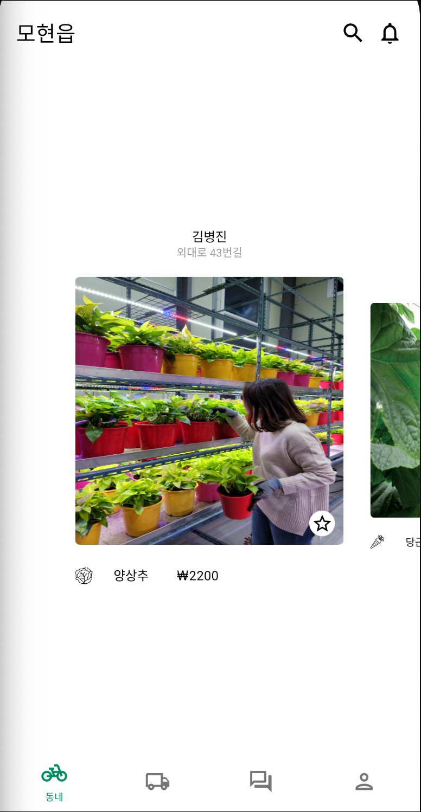
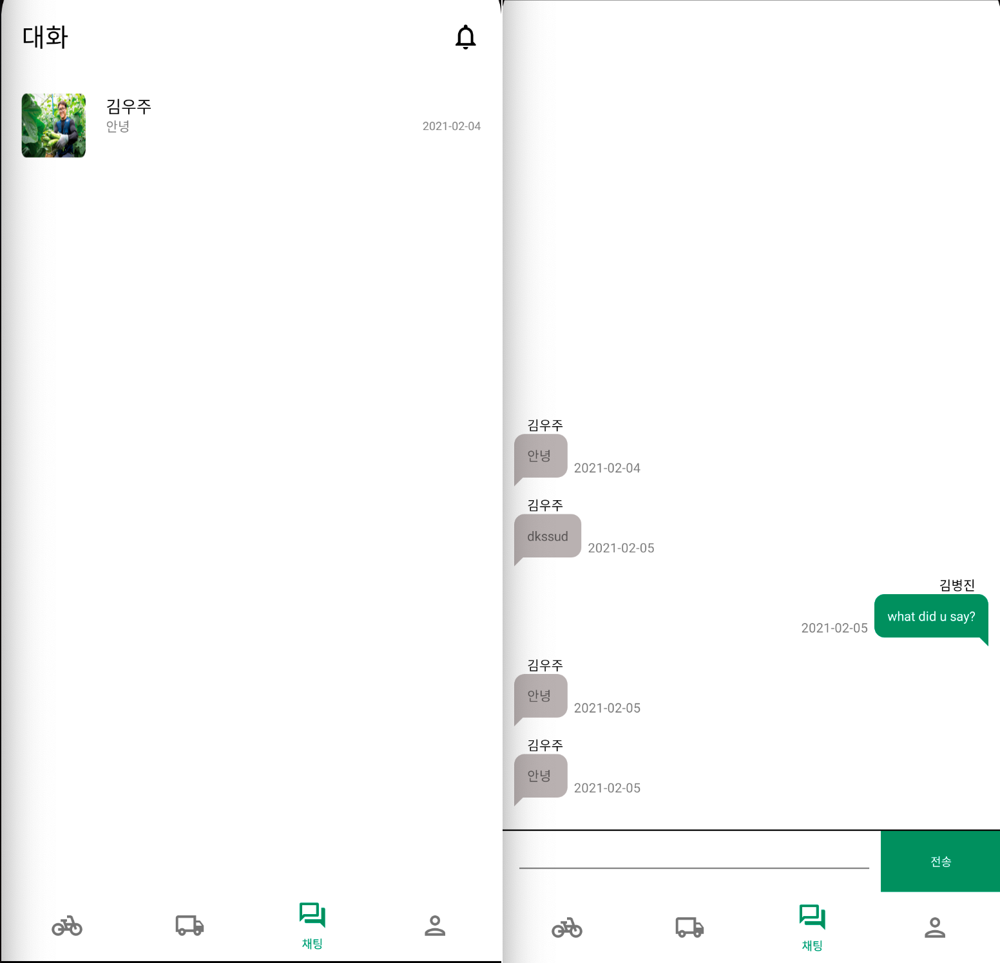

# PlantPoint Android (...ing)

농부가 물건을 소비자와 바로 사고 팔 수 있는 서비스를 만들고자 합니다. 동네 주변의 농가와 직거래할 수도 있고 전국적으로 온라인 판매할 수 있도록 하고자 합니다. 농부와 대화하고 사고 팔 수 있도록 채팅 서비스도 만들었습니다.

 

## Environments

* OS : Mac
* Language : Kotlin
* DB & Backend : Firebase

 

## Usage

  

* 주변에 있는 농가와 직거래로 연결시켜 주는 서비스입니다. 

 

< 준비 중 >

 

* 전국에 있는 농가와 배송 거래로 연결시켜 주는 서비스입니다. 

  

* 농가와 소비자 간의 채팅할 수 있는 서비스입니다.

